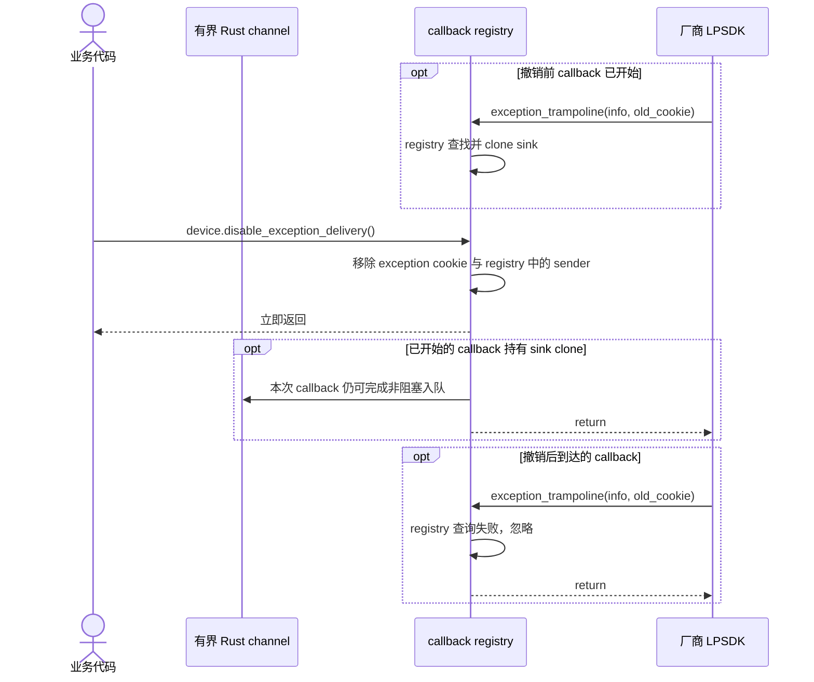

# callback 采集与停止

```mermaid
sequenceDiagram
    autonumber
    actor App as 业务代码
    participant Public as mv3d-lp 公共 API
    participant Queue as 有界 Rust channel
    participant Core as callback registry 与 trampoline
    participant Native as 厂商 LPSDK

    App->>Public: device.start_receiving(options)
    Public->>Queue: sync_channel(queue_capacity)
    Public->>Core: Device::start_callback(sink)
    Core->>Core: 检查 needs_stop
    alt needs_stop = true
        Core-->>Public: InvalidState，不调用 Register 或 Start
        Public-->>App: Err
    else needs_stop = false
        Core->>Core: 用不复用的 cookie 注册 sink
        Core->>Native: MV3D_LP_RegisterImageDataCallBack(handle, trampoline, cookie)
        Native-->>Core: register status
        alt register 成功
            Core->>Native: MV3D_LP_StartMeasure(handle)
            Native-->>Core: start status
            alt Start 成功
                Core->>Core: 保存 registration，needs_stop = true
                Core-->>Public: Ok
                Public-->>App: Receiver&lt;Frame&gt;
            else Start 失败
                Core->>Core: 移除本次 cookie，needs_stop 仍为 false
                Core-->>Public: Err
                Public-->>App: Err
            end
        else register 失败
            Core->>Core: 移除本次 cookie
            Core-->>Public: Err
            Public-->>App: Err
        end
    end

    loop 每次原生图像回调
        Native->>Core: image_trampoline(image_ptr, cookie)
        Core->>Core: registry 查找并 clone sink
        alt cookie 已撤销或未知
            Core-->>Native: 忽略迟到 callback
        else 找到 sink
            Core->>Core: 校验并立即复制为 Frame
            alt payload 可复制
                Core->>Queue: try_send(frame)
                alt 队列有空位
                    Queue-->>Core: queued
                else image 队列已满
                    Core->>Core: 丢弃本次新 frame
                else Receiver 已关闭
                    Core->>Core: 移除 cookie，停止后续 Rust delivery
                end
            else descriptor 为空或违反指针、长度、布局契约
                Core->>Core: fail-fast，终止进程
            end
            Core-->>Native: trampoline 返回
        end
    end

    Note over App,Queue: Receiver 的消费节奏与原生 callback 解耦
    loop 按业务节奏消费
        App->>Queue: receiver.recv()
        Queue-->>App: Frame
    end

    App->>Public: device.stop()
    Public->>Core: Device::stop()
    Core->>Native: MV3D_LP_StopMeasure(handle)
    Native-->>Core: status
    alt Stop 成功
        Core->>Core: needs_stop = false，移除 image cookie
        Core-->>Public: Ok
        Public-->>App: Ok
    else Stop 失败
        Core->>Core: needs_stop 仍为 true，registration 仍由 Device 持有
        Core-->>Public: Err
        Public-->>App: Err
    end

    opt 显式 close 或 Drop
        Core->>Core: 取走 handle
        opt needs_stop = true
            Core->>Native: MV3D_LP_StopMeasure(handle) 一次
            Native-->>Core: stop status
        end
        Core->>Native: MV3D_LP_CloseDevice(handle) 一次
        Native-->>Core: close status
        alt Close 成功
            Note over Core,Native: 返回前该 handle 的 native callback 已静默
            Core->>Core: 移除 image 与 exception cookie
        else Close 失败
            Core->>Core: 移除 cookie，finalize_blocked = true
            Core->>Core: FileAccess backing 封存至进程退出
            Note over Core,Native: 不推断 native callback 或 handle 状态；调用方结束进程
        end
    end
```

`Receiver<Frame>` 与 `Frame` 均不借用 `Device`。trampoline 只复制 payload 并非阻塞入队，符合官方 CHM“图像 callback 内不建议调用其他 SDK 接口”的说明。image 队列满时丢弃最新帧并继续 delivery，避免阻塞 SDK callback thread。

`start_receiving()` 因 Register→Start 包含两个 native 调用，只在 `needs_stop` 为 true 时由 wrapper 拒绝；普通 `start()` 与 `stop()` 的调用顺序直接交给 SDK。registry 的作用仅是隔离迟到 callback：cookie 从不复用且不作为指针解引用，registration 撤销后，旧 callback 无法命中新 sink。callback 在撤销前若已取得 sink clone，仍可完成本次复制或入队；`stop()`、`disable_exception_delivery()` 与 Close failure 路径都不等待它返回。仅成功的 `MV3D_LP_CloseDevice` 被视为 native callback 静默边界。Close 失败时 wrapper 仍可安全移除 cookie；迟到 callback lookup miss，已取得的 sink clone 自行完成。随后 `finalize_blocked` 阻止 Finalize，由调用方结束进程。

trampoline 是不可 unwind 的 FFI 边界。callback 中发生 panic、cookie 为空或 descriptor 违反 SDK 契约时直接终止进程，不引入跨 FFI 恢复状态。未知或已撤销的非空 cookie 仍视为迟到 callback 并忽略。registry mutex 遇到 poison 时继续取得已拥有的 entries，不把普通 Rust panic 改写为库级 abort。上述终止路径不会执行 `Device::drop`；普通 SDK 错误继续通过 `Result` 返回，由应用在局部 owner 离开 `run()` 作用域后决定是否结束进程。

## exception delivery 停止



厂商接口只提供 exception callback register，因此 `disable_exception_delivery()` 只停止后续 Rust delivery。Receiver 会在 registry sender 和可能存在的 sink clone 都释放后断开；调用方无需把“方法返回”解释为原生 callback 已静默。

exception callback 使用有界非阻塞队列。队列满时丢弃当前异常并移除 registry 中的 sink，终止后续 Rust delivery；已有 callback 释放 sink 后，Receiver 仍可读完已经排队的异常，随后得到 disconnected。断开原因不编码，调用方无法仅凭 Receiver 区分队列溢出、显式停止或设备关闭。image callback 则在队列满时只丢弃最新帧并继续 delivery。

## 待确认厂商契约

- callback 参数在 ABI 上可为空，但当前头文件摘录与公开 sample 未说明传 `NULL` 是否表示注销；确认前 wrapper 仅撤销 Rust cookie。
- 同一 handle 是否允许重复注册，以及跨 Stop、再次 Start、pull/callback 模式切换时旧 callback 与 user data 的替换规则。
