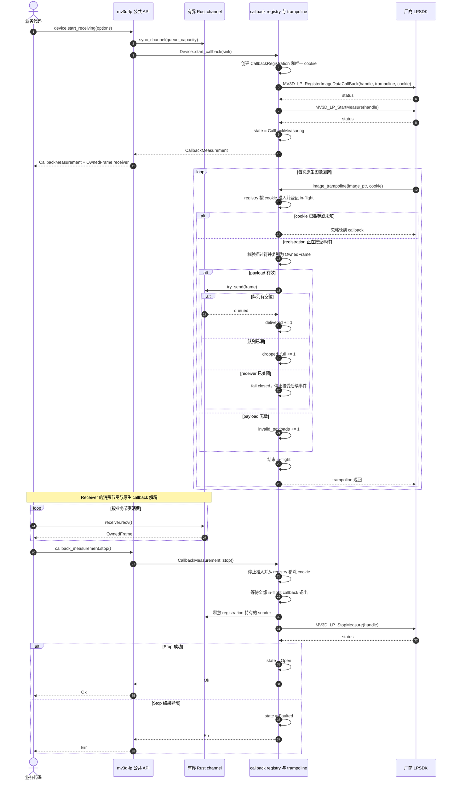

# callback 采集与停止

```mermaid
sequenceDiagram
    autonumber
    actor App as 业务代码
    participant Public as mv3d-lp 公共 API
    participant Queue as 有界 Rust channel
    participant Core as callback registry 与 trampoline
    participant Native as 厂商 LPSDK

    App->>Public: device.start_receiving(options)
    Public->>Queue: sync_channel(queue_capacity)
    Public->>Core: Device::start_callback(sink)
    Core->>Core: 创建 CallbackRegistration 和唯一 cookie
    Core->>Native: MV3D_LP_RegisterImageDataCallBack(handle, trampoline, cookie)
    Native-->>Core: status
    Core->>Native: MV3D_LP_StartMeasure(handle)
    Native-->>Core: status
    Core->>Core: state = CallbackMeasuring
    Core-->>Public: CallbackMeasurement
    Public-->>App: CallbackMeasurement + OwnedFrame receiver

    loop 每次原生图像回调
        Native->>Core: image_trampoline(image_ptr, cookie)
        Core->>Core: registry 按 cookie 准入并登记 in-flight
        alt cookie 已撤销或未知
            Core-->>Native: 忽略晚到 callback
        else registration 正在接受事件
            Core->>Core: 校验描述符并复制为 OwnedFrame
            alt payload 有效
                Core->>Queue: try_send(frame)
                alt 队列有空位
                    Queue-->>Core: queued
                    Core->>Core: delivered += 1
                else 队列已满
                    Core->>Core: dropped_full += 1
                else receiver 已关闭
                    Core->>Core: fail closed，停止接受后续事件
                end
            else payload 无效
                Core->>Core: invalid_payloads += 1
            end
            Core->>Core: 结束 in-flight
            Core-->>Native: trampoline 返回
        end
    end

    Note over App,Queue: Receiver 的消费节奏与原生 callback 解耦
    loop 按业务节奏消费
        App->>Queue: receiver.recv()
        Queue-->>App: OwnedFrame
    end

    App->>Public: callback_measurement.stop()
    Public->>Core: CallbackMeasurement::stop()
    Core->>Core: 停止准入并从 registry 移除 cookie
    Core->>Core: 等待全部 in-flight callback 退出
    Core->>Queue: 释放 registration 持有的 sender
    Core->>Native: MV3D_LP_StopMeasure(handle)
    Native-->>Core: status
    alt Stop 成功
        Core->>Core: state = Open
        Core-->>Public: Ok
        Public-->>App: Ok
    else Stop 结果异常
        Core->>Core: state = Faulted
        Core-->>Public: Err
        Public-->>App: Err
    end
```
