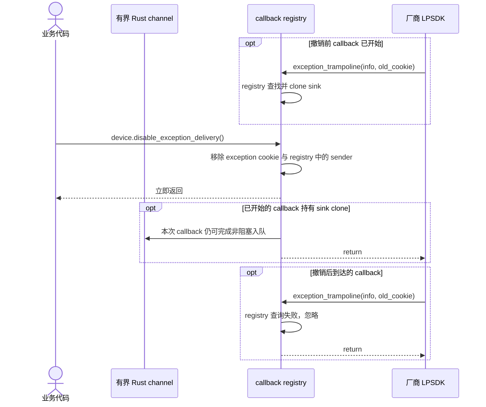

# callback 采集与停止

```mermaid
sequenceDiagram
    autonumber
    actor App as 业务代码
    participant Public as mv3d-lp 公共 API
    participant Queue as 有界 Rust channel
    participant Core as callback registry 与 trampoline
    participant Native as 厂商 LPSDK

    App->>Public: device.start_receiving(options)
    Public->>Queue: sync_channel(queue_capacity)
    Public->>Core: Device::start_callback(sink)
    Core->>Core: 用不复用的 cookie 注册 sink
    Core->>Native: MV3D_LP_RegisterImageDataCallBack(handle, trampoline, cookie)
    Native-->>Core: register status
    alt register 成功
        Core->>Native: MV3D_LP_StartMeasure(handle)
        Native-->>Core: start status
        alt Start 成功
            Core->>Core: 保存 registration，measuring = true
            Core-->>Public: Ok
            Public-->>App: Receiver&lt;Frame&gt;
        else Start 失败
            Core->>Core: 移除本次 cookie
            Core-->>Public: Err
            Public-->>App: Err
        end
    else register 失败
        Core->>Core: 移除本次 cookie
        Core-->>Public: Err
        Public-->>App: Err
    end

    loop 每次原生图像回调
        Native->>Core: image_trampoline(image_ptr, cookie)
        Core->>Core: registry 查找并 clone sink
        alt cookie 已撤销或未知
            Core-->>Native: 忽略迟到 callback
        else 找到 sink
            Core->>Core: 校验并立即复制为 Frame
            alt payload 可复制
                Core->>Queue: try_send(frame)
                alt 队列有空位
                    Queue-->>Core: queued
                else 队列已满
                    Core->>Core: 丢弃本次新 frame
                else Receiver 已关闭
                    Core->>Core: 移除 cookie，停止后续 Rust delivery
                end
            else payload 无法复制
                Core->>Core: 忽略本次 callback
            end
            Core-->>Native: trampoline 返回
        end
    end

    Note over App,Queue: Receiver 的消费节奏与原生 callback 解耦
    loop 按业务节奏消费
        App->>Queue: receiver.recv()
        Queue-->>App: Frame
    end

    App->>Public: device.stop()
    Public->>Core: Device::stop()
    Core->>Native: MV3D_LP_StopMeasure(handle)
    Native-->>Core: status
    alt Stop 成功
        Core->>Core: measuring = false，移除 image cookie
        Core-->>Public: Ok
        Public-->>App: Ok
    else Stop 失败
        Core->>Core: 保留 measuring 与 registration
        Core-->>Public: Err
        Public-->>App: Err；可再次 stop 或关闭
    end

    opt 显式 close 或 Drop
        Core->>Core: 取走 handle
        opt measuring = true
            Core->>Native: MV3D_LP_StopMeasure(handle) 一次
            Native-->>Core: stop status
        end
        Core->>Native: MV3D_LP_CloseDevice(handle) 一次
        Native-->>Core: close status
        Core->>Core: 移除 image 与 exception cookie
    end
```

`Receiver<Frame>` 与 `Frame` 均不借用 `Device`。trampoline 只复制 payload 并非阻塞入队，符合官方 CHM“图像 callback 内不建议调用其他 SDK 接口”的说明。队列满时丢弃最新事件，避免阻塞 SDK callback thread。

registry 的作用仅是隔离迟到 callback：cookie 从不复用，registration 撤销后，旧 callback 无法命中新 sink。callback 在撤销前若已取得 sink clone，仍可完成本次复制或入队；`stop()`、`disable_exception_delivery()` 和关闭路径都不等待它返回。厂商是否在 Stop/Close 返回时保证 callback 静默仍待确认。

## exception delivery 停止



厂商接口只提供 exception callback register，因此 `disable_exception_delivery()` 只停止后续 Rust delivery。Receiver 会在 registry sender 和可能存在的 sink clone 都释放后断开；调用方无需把“方法返回”解释为原生 callback 已静默。

## 待确认厂商契约

- `MV3D_LP_StopMeasure` 与 `MV3D_LP_CloseDevice` 返回时，image/exception callback 是否已静默。
- 同一 handle 是否允许重复注册，以及跨 Stop、再次 Start、pull/callback 模式切换时旧 callback 与 user data 的替换规则。
