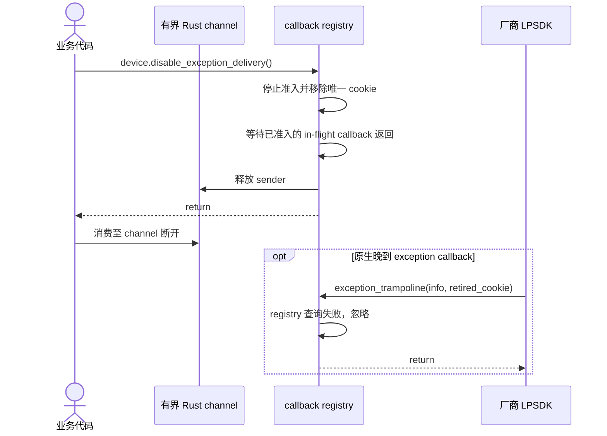

# callback 采集与停止

```mermaid
sequenceDiagram
    autonumber
    actor App as 业务代码
    participant Public as mv3d-lp 公共 API
    participant Queue as 有界 Rust channel
    participant Core as callback registry 与 trampoline
    participant Native as 厂商 LPSDK

    App->>Public: device.start_receiving(options)
    Public->>Queue: sync_channel(queue_capacity)
    Public->>Core: Device::start_callback(sink)
    Core->>Core: 创建 CallbackRegistration 和唯一 cookie
    Core->>Native: MV3D_LP_RegisterImageDataCallBack(handle, trampoline, cookie)
    Native-->>Core: status
    Core->>Native: MV3D_LP_StartMeasure(handle)
    Native-->>Core: status
    Core->>Core: Device 保存 registration，state = CallbackMeasuring
    Core-->>Public: Ok
    Public-->>App: Receiver&lt;Frame&gt;

    loop 每次原生图像回调
        Native->>Core: image_trampoline(image_ptr, cookie)
        Core->>Core: registry 按 cookie 准入并登记 in-flight
        alt cookie 已撤销或未知
            Core-->>Native: registry 拒绝 delivery
        else registration 正在接受事件
            Core->>Core: 校验并复制为 Frame
            alt payload 有效
                Core->>Queue: try_send(frame)
                alt 队列有空位
                    Queue-->>Core: queued
                    Core->>Core: delivered += 1
                else 队列已满
                    Core->>Core: dropped_full += 1
                else receiver 已关闭
                    Core->>Core: fail closed，停止接受后续事件
                end
            else payload 无效
                Core->>Core: invalid_payloads += 1
            end
            Core->>Core: 结束 in-flight
            Core-->>Native: trampoline 返回
        end
    end

    Note over App,Queue: Receiver 的消费节奏与原生 callback 解耦
    loop 按业务节奏消费
        App->>Queue: receiver.recv()
        Queue-->>App: Frame
    end

    App->>Public: device.stop()
    Public->>Core: Device::stop()
    Core->>Core: 停止准入并从 registry 移除 cookie
    Core->>Core: 等待全部 in-flight callback 退出
    Core->>Queue: 释放 registration 持有的 sender
    Core->>Native: MV3D_LP_StopMeasure(handle)
    Native-->>Core: status
    alt Stop 成功
        Core->>Core: state = Open
        Core-->>Public: Ok
        Public-->>App: Ok
    else Stop 结果异常
        Core->>Core: state = Faulted
        Core-->>Public: Err
        Public-->>App: Err
    end

    opt Stop 失败后显式 close
        App->>Public: device.close()
        Public->>Core: Device cleanup
        Core->>Native: MV3D_LP_StopMeasure(handle) 再尝试一次
        Native-->>Core: retry status
        alt retry 成功
            Core->>Core: state = Open
        else retry 失败
            Core->>Core: state = Faulted
        end
        Core->>Native: MV3D_LP_CloseDevice(handle)
        Native-->>Core: close status
        Note over Core,Native: Close 失败时保留 handle；显式 close(self) 的 Drop 再试一次
        Note over Core,Native: Stop 成功已回 Open，Drop 不重复 Stop；连续 Close 失败才阻止 Finalize
    end
    Note over App,Core: 直接 drop(device) 只执行 Drop 自身的一次尽力清理
```

`Receiver<Frame>` 与 `Frame` 均不借用 `Device`；调用方可在当前线程消费 Receiver，也可将其移入自建线程。帧入队前已复制主数据、亮度数据和曝光时间戳，`Frame` 是 `Image` 的类型别名。SDK handle、registration、cookie 与清理责任均留在 `Device`。原生接口只提供 register；当前 wrapper 用 registry、cookie 撤销和 in-flight drain 作为保守兼容措施。下一次 `start_receiving()` 会创建新 cookie，厂商是否支持同一 handle 重复注册仍待确认。完整状态图见[生命周期与时序图总览](../生命周期与时序图.md)。

## exception delivery 停止



厂商接口只提供 exception callback register，因此 `disable_exception_delivery()` 只撤销 Rust delivery。它可重复调用；registry 会拒绝已撤销 cookie 的 delivery。显式 disable 后，Receiver 可在当前线程消费至断开；若调用方自建消费线程，则由调用方结束该线程。旧 callback 是否可能在 Stop/Close 后继续到达属于待确认契约。

## 待确认厂商契约

- `MV3D_LP_StopMeasure` 与 `MV3D_LP_CloseDevice` 返回时，image/exception callback 是否已静默。
- 同一 handle 是否允许重复注册，以及跨 Stop、再次 start、pull/callback 模式切换时旧 callback 与 user data 的替换规则。
