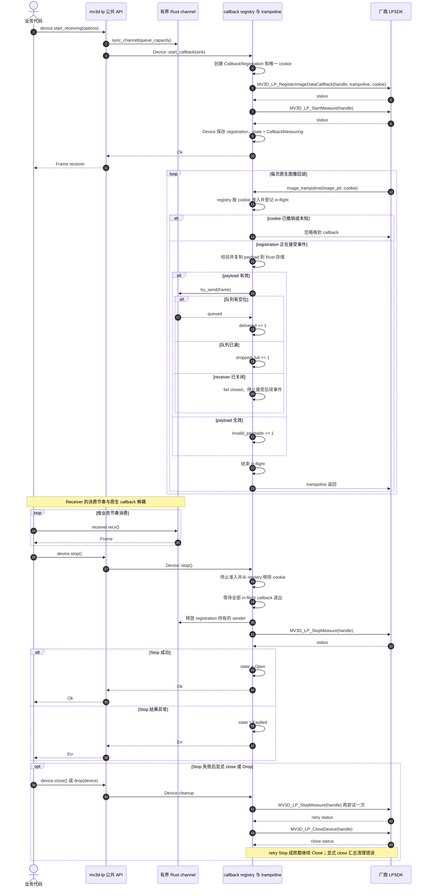
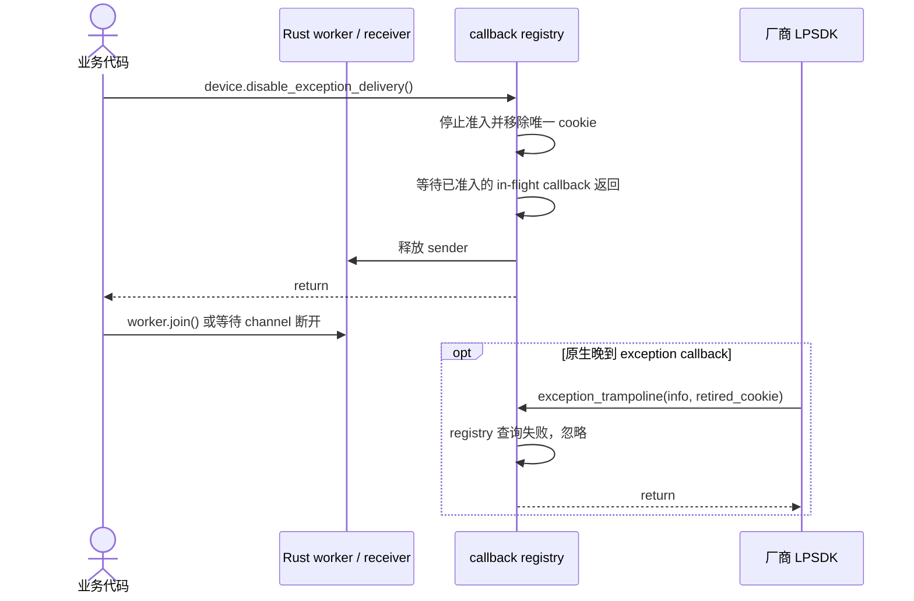

# callback 采集与停止

`Frame` 入队前已复制 SDK payload；SDK handle、registration、cookie 与清理责任均留在 `Device`。已审计的原生 callback 接口只包含 register；wrapper 通过撤销 cookie 准入并等待 in-flight callback 退出来隔离晚到调用。若同一 handle 再次注册被厂商 runtime 接受，下一次 `start_receiving()` 会使用全新的 cookie；wrapper 不额外承诺设备或固件一定支持重复注册。完整状态图见[生命周期与时序图总览](../生命周期与时序图.md)。

## exception delivery 停止

厂商接口只提供 exception callback register，因此 `disable_exception_delivery()` 只撤销 Rust delivery。它可重复调用；原生侧仍可能使用旧 cookie 调用 trampoline，registry 会安全忽略。显式 disable 后再 join exception worker，可让 sender 正常释放。
