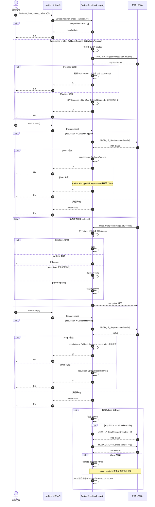
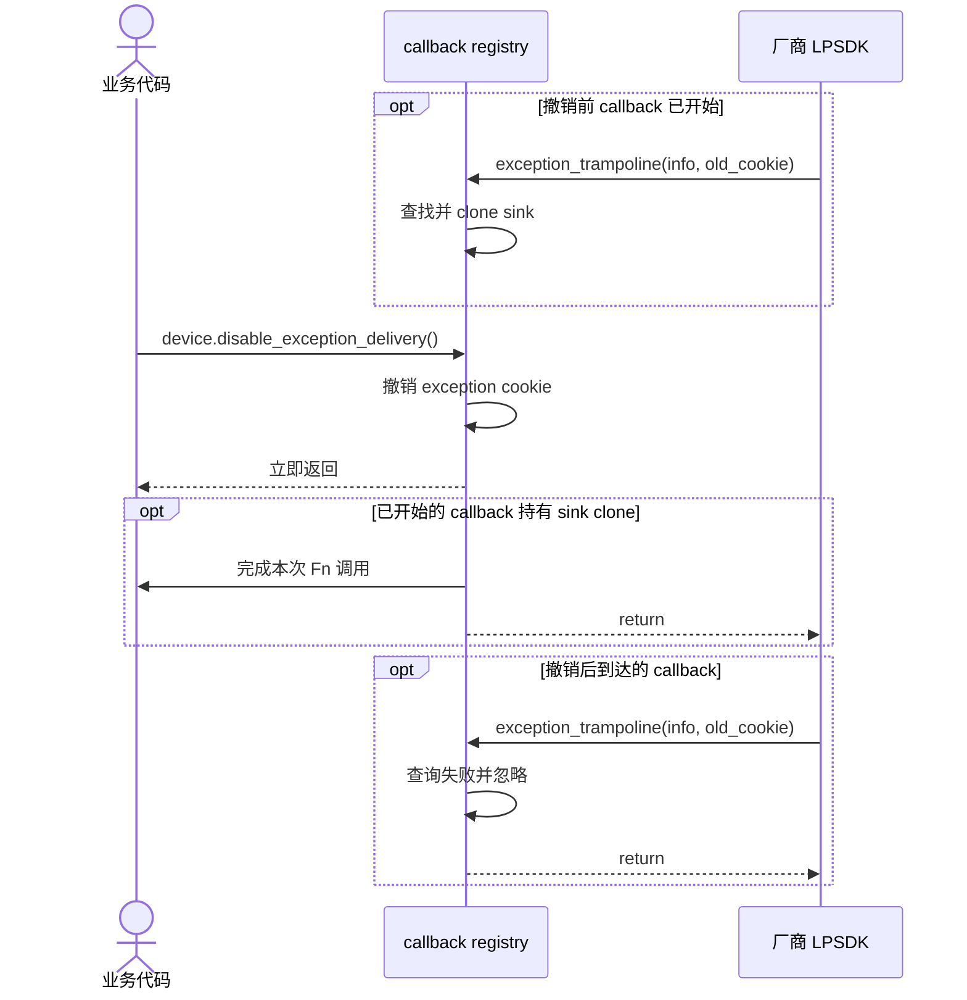

# callback 采集与停止

Register 成功即把该 handle 绑定到 callback 至 Close。该规则覆盖后续 Start 失败和 Stop 成功。`CallbackStopped` 仍可再次 `register_image_callback()` 以替换 cookie，但不能回到 pull。Stop 成功后可再次 `start()`。

trampoline 在原生 callback 返回前复制全部 payload，再调用用户 `Fn(Image)`。非法 descriptor 或空指针跳过本次投递。用户代码 panic 时截获并静默该 cookie。cookie 只作不复用的整数标识，Rust 不解引用 user data。Close 返回后撤销 cookie；此前已取得的 sink clone 可以完成本次投递。仅 Close 成功代表 native callback 已静默，Close 失败则由 `finalize_blocked` 阻止 Finalize。

## exception delivery 停止

`disable_exception_delivery()` 与 `disable_image_delivery()` 只停止后续 Rust delivery。

## 待确认厂商契约

- callback 参数在 ABI 上可为空，当前头文件与 sample 未说明传 `NULL` 是否表示注销；wrapper 因此仅撤销 Rust cookie。
