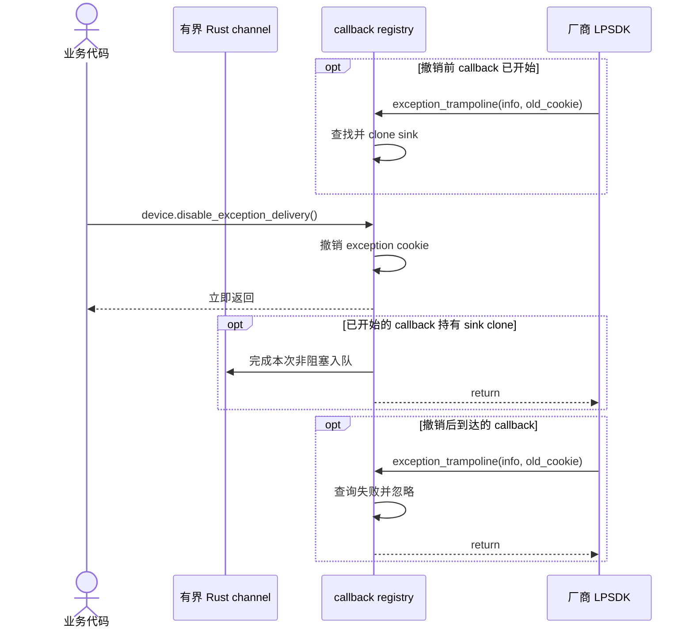

# callback 采集与停止

```mermaid
sequenceDiagram
    autonumber
    actor App as 业务代码
    participant Public as mv3d-lp 公共 API
    participant Queue as 有界 Rust channel
    participant Core as Device 与 callback registry
    participant Native as 厂商 LPSDK

    App->>Public: device.start_receiving(options)
    Public->>Queue: sync_channel(queue_capacity)
    Public->>Core: Device::start_callback(sink)
    alt acquisition 不是 Idle
        Core-->>Public: InvalidState
        Public-->>App: Err
    else acquisition = Idle
        Core->>Core: 创建不复用的 cookie
        Core->>Native: MV3D_LP_RegisterImageDataCallBack(...)
        Native-->>Core: register status
        alt Register 失败
            Core->>Core: 撤销本次 cookie，状态仍为 Idle
            Core-->>Public: Err
            Public-->>App: Err
        else Register 成功
            Core->>Core: acquisition = CallbackStopped，保存 registration
            Core->>Native: MV3D_LP_StartMeasure(handle)
            Native-->>Core: start status
            alt Start 成功
                Core->>Core: acquisition = CallbackRunning
                Core-->>Public: Ok
                Public-->>App: Receiver&lt;Frame&gt;
            else Start 失败
                Note over Core: CallbackStopped 与 registration 保存至 Close
                Core-->>Public: Err
                Public-->>App: Err
            end
        end
    end

    loop 每次原生图像 callback
        Native->>Core: image_trampoline(image_ptr, cookie)
        Core->>Core: 查找 sink，校验并复制为 Frame
        alt cookie 已撤销或 Receiver 已关闭
            Core->>Core: 忽略或停止后续 Rust delivery
        else payload 有效且队列有空位
            Core->>Queue: try_send(frame)
        else image 队列已满
            Core->>Core: 丢弃最新 frame
        else descriptor 违反契约
            Core->>Core: 终止进程
        end
        Core-->>Native: trampoline 返回
    end

    App->>Public: device.stop()
    Public->>Core: Device::stop()
    alt acquisition = CallbackRunning
        Core->>Native: MV3D_LP_StopMeasure(handle)
        Native-->>Core: status
        alt Stop 成功
            Core->>Core: acquisition = CallbackStopped，registration 继续持有
            Core-->>Public: Ok
            Public-->>App: Ok
        else Stop 失败
            Core->>Core: acquisition 仍为 CallbackRunning
            Core-->>Public: Err
            Public-->>App: Err
        end
    else 其他状态
        Core-->>Public: InvalidState
        Public-->>App: Err
    end

    opt 显式 close 或 Drop
        Core->>Core: 取走 handle
        opt acquisition = CallbackRunning
            Core->>Native: MV3D_LP_StopMeasure(handle) 一次
            Native-->>Core: stop status
        end
        Core->>Native: MV3D_LP_CloseDevice(handle) 一次
        Native-->>Core: close status
        alt Close 失败
            Core->>Core: finalize_blocked = true，封存 FileAccess backing
            Note over Core,Native: native handle 状态交给进程退出处理
        end
        Core->>Core: Close 返回后撤销 image 与 exception cookie
    end
```

Register 成功即把该 handle 绑定到 callback 至 Close。该规则覆盖后续 Start 失败和 Stop 成功，`CallbackStopped` 会拒绝 `start()`、`start_receiving()` 与 `stop()`，从而避开厂商未说明的 callback 注销、重复注册和 pull/callback 切换契约。Stop 成功后 registration 中的 sender 仍存活；调用方读完所需帧后可主动丢弃 Receiver。

trampoline 在原生 callback 返回前复制全部 payload，再通过有界 channel 非阻塞投递。image 队列满时丢弃最新帧；Receiver 关闭时停止后续 Rust delivery。cookie 只作不复用的整数标识，Rust 不解引用 user data。Close 返回后撤销 cookie；此前已取得的 sink clone 可以完成本次投递。仅 Close 成功代表 native callback 已静默，Close 失败则由 `finalize_blocked` 阻止 Finalize。

callback ABI 无法返回 Rust 错误。callback panic、空参数或非法 descriptor 会直接终止进程；未知或已撤销的非空 cookie 作为迟到 callback 忽略。普通 SDK 错误继续通过 `Result` 返回。

## exception delivery 停止



`disable_exception_delivery()` 只停止后续 Rust delivery。队列满时丢弃当前异常并撤销 sink；Receiver 读完已排队事件后断开。断开原因不编码。

## 待确认厂商契约

- callback 参数在 ABI 上可为空，当前头文件与 sample 未说明传 `NULL` 是否表示注销；wrapper 因此仅撤销 Rust cookie。
