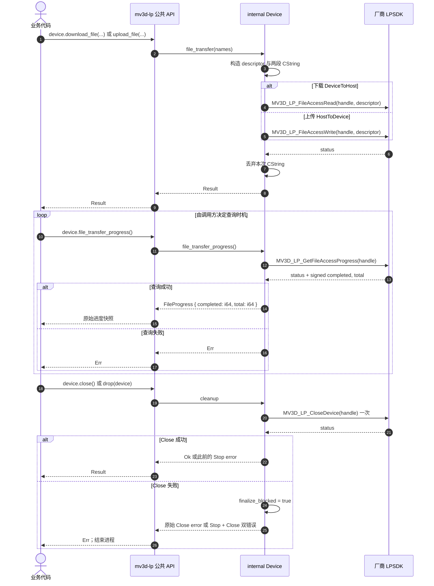

# 文件上传与下载

`MV3D_LP_FILE_ACCESS` 的两个字段是裸 `const char*`。wrapper 把文件名作为本次 native 调用的 `[IN]` 字符串传入，调用返回后即释放。FileAccess 不引入 wrapper 状态，重复启动、与采集并行以及查询时机均直接交给 SDK 判断。`file_transfer_progress()` 只复制一次 `MV3D_LP_FILE_ACCESS_PROGRESS`，保留厂商返回的 signed `completed` 与 `total`；库不校验非负、不比较两者，也不定义 Running 或 Completed。轮询、backoff、async 调度和完成判定由调用方负责。

## 待确认厂商契约

- FileAccess 启动返回后是否已复制文件名。
- signed `completed`、`total` 以及 `(0, 0)` 的完成语义。
