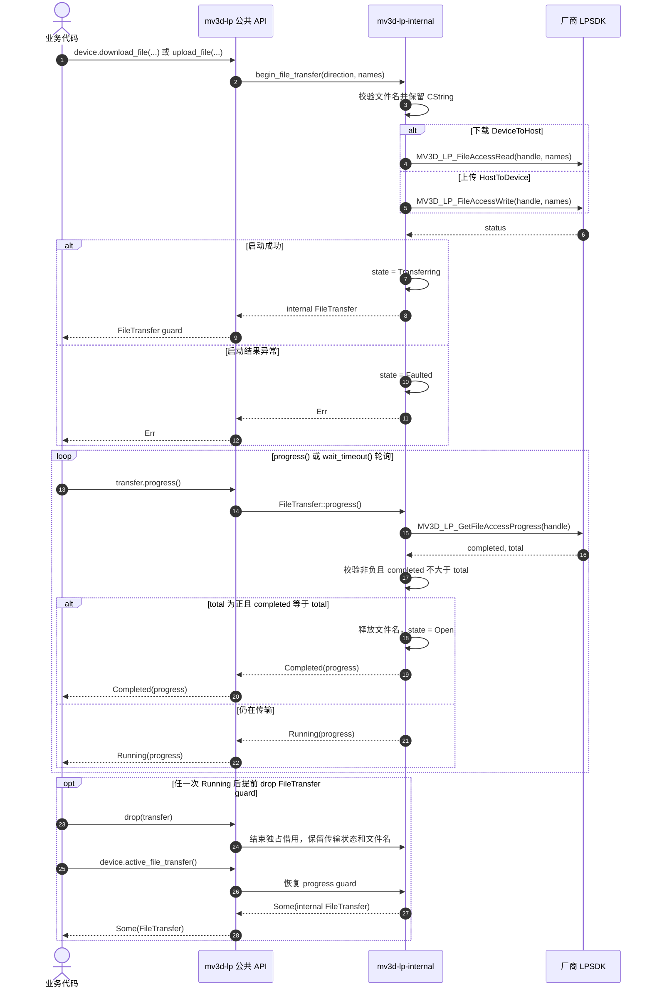

# 文件上传与下载

```mermaid
sequenceDiagram
    autonumber
    actor App as 业务代码
    participant Public as mv3d-lp 公共 API
    participant Core as mv3d-lp-internal
    participant Native as 厂商 LPSDK

    App->>Public: device.download_file(...) 或 upload_file(...)
    Public->>Core: begin_file_transfer(direction, names)
    Core->>Core: 校验文件名并保留 CString
    alt 下载 DeviceToHost
        Core->>Native: MV3D_LP_FileAccessRead(handle, names)
    else 上传 HostToDevice
        Core->>Native: MV3D_LP_FileAccessWrite(handle, names)
    end
    Native-->>Core: status
    alt 启动成功
        Core->>Core: state = Transferring
        Core-->>Public: internal FileTransfer
        Public-->>App: FileTransfer guard
    else 启动结果异常
        Core->>Core: state = Faulted
        Core-->>Public: Err
        Public-->>App: Err
    end

    loop progress() 或 wait_timeout() 轮询
        App->>Public: transfer.progress()
        Public->>Core: FileTransfer::progress()
        Core->>Native: MV3D_LP_GetFileAccessProgress(handle)
        Native-->>Core: completed, total
        Core->>Core: 校验非负且 completed 不大于 total
        alt total 为正且 completed 等于 total
            Core->>Core: 释放文件名，state = Open
            Core-->>Public: Completed(progress)
            Public-->>App: Completed(progress)
        else 仍在传输
            Core-->>Public: Running(progress)
            Public-->>App: Running(progress)
        end
    end

    opt 任一次 Running 后提前 drop FileTransfer guard
        App->>Public: drop(transfer)
        Public->>Core: 结束独占借用，保留传输状态和文件名
        App->>Public: device.active_file_transfer()
        Public->>Core: 恢复 progress guard
        Core-->>Public: Some(internal FileTransfer)
        Public-->>App: Some(FileTransfer)
    end
```
