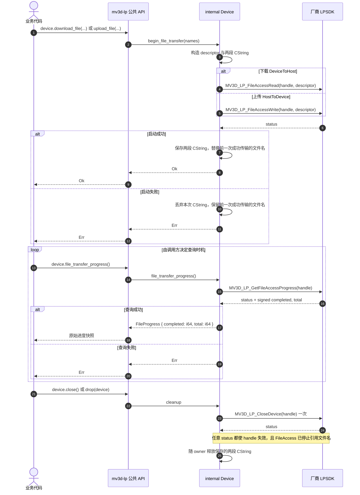

# 文件上传与下载

`MV3D_LP_FILE_ACCESS` 的两个字段是裸 `const char*`。头文件的 `[IN]` 只表示参数方向，未说明异步传输是否继续持有字符串。wrapper 因此在 Read/Write 成功后由 `Device` 保留两段 CString，直到下一次成功 FileAccess 替换它们，或 Close 返回后释放。本次启动失败不会缩短前一次文件名的生命周期。清理依赖厂商契约：Close 返回时，即使 status 为错误，handle 也永久失效，FileAccess 已停止引用文件名。

FileAccess 不引入 wrapper 状态，重复启动、与采集并行以及查询时机均直接交给 SDK 判断。`file_transfer_progress()` 只复制一次 `MV3D_LP_FILE_ACCESS_PROGRESS`，保留厂商返回的 signed `completed` 与 `total`；库不校验非负、不比较两者，也不定义 Running 或 Completed。轮询、backoff、async 调度和完成判定由调用方负责。

## 待确认厂商契约

- FileAccess 启动返回后是否已复制文件名；若确认复制，可删除 `Device` 中的两段 CString。
- 下一次成功 FileAccess 是否必然替代前一次传输对文件名的引用。
- signed `completed`、`total` 以及 `(0, 0)` 的完成语义。
