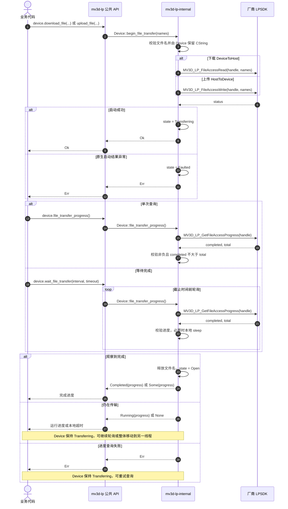

# 文件上传与下载

```mermaid
sequenceDiagram
    autonumber
    actor App as 业务代码
    participant Public as mv3d-lp 公共 API
    participant Core as mv3d-lp-internal
    participant Native as 厂商 LPSDK

    App->>Public: device.download_file(...) 或 upload_file(...)
    Public->>Core: Device::begin_file_transfer(names)
    Core->>Core: 校验文件名并由 Device 保留 CString
    alt 下载 DeviceToHost
        Core->>Native: MV3D_LP_FileAccessRead(handle, names)
    else 上传 HostToDevice
        Core->>Native: MV3D_LP_FileAccessWrite(handle, names)
    end
    Native-->>Core: status
    alt 启动成功
        Core->>Core: state = Transferring
        Core-->>Public: Ok
        Public-->>App: Ok
    else 原生启动结果异常
        Core->>Core: state = Faulted
        Core-->>Public: Err
        Public-->>App: Err
    end

    alt 单次查询
        App->>Public: device.file_transfer_progress()
        Public->>Core: Device::file_transfer_progress()
        Core->>Native: MV3D_LP_GetFileAccessProgress(handle)
        Native-->>Core: completed, total
        Core->>Core: 校验非负且 completed 不大于 total
    else 等待完成
        App->>Public: device.wait_file_transfer(interval, timeout)
        loop 截止时间前轮询
            Public->>Core: Device::file_transfer_progress()
            Core->>Native: MV3D_LP_GetFileAccessProgress(handle)
            Native-->>Core: completed, total
            Core->>Core: 校验进度，必要时本地 sleep
        end
    end

    alt 观察到完成
        Core->>Core: 释放文件名，state = Open
        Core-->>Public: Completed(progress) 或 Some(progress)
        Public-->>App: 完成进度
    else 仍在传输
        Core-->>Public: Running(progress) 或 None
        Public-->>App: 运行进度或本地超时
        Note over App,Core: Device 保持 Transferring，可继续轮询或整体移动到另一线程
    else 进度查询失败
        Core-->>Public: Err
        Public-->>App: Err
        Note over App,Core: Device 保持 Transferring，可重试查询
    end
```

原生 FileAccess 异步使用文件名，因此 `Device` 在观察到完成或成功关闭前保留两侧文件名。传输期间其他设备操作按状态拒绝；需要跨线程继续传输时直接移动 `Device`。Close 失败时原生终止状态不确定，`close()` 与 `Drop` 会故意保留这两段字符串存储，防止晚到读取访问已释放内存。
