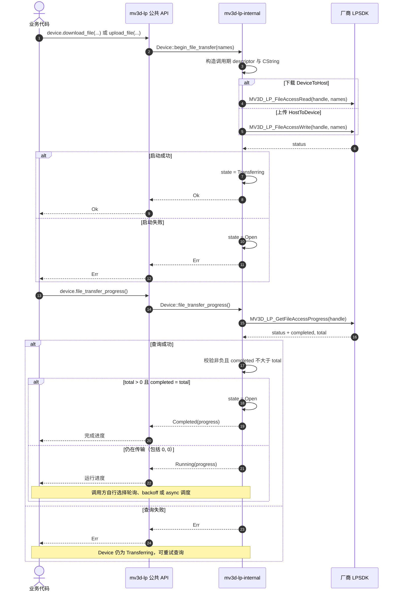

# 文件上传与下载

头文件把 `MV3D_LP_FILE_ACCESS` 标为 `[IN]`，wrapper 因此只在 Read/Write 调用期间借用 descriptor 与两段字符串。调用成功才进入 `Transferring`，失败时仍为 `Open`。若厂商另有异步借用要求，需要重新审计该边界。`file_transfer_progress()` 只查询一次；调用方自行安排轮询、backoff 或 async。当前以 `total > 0 && completed == total` 判定完成，`(0, 0)` 仍按 Running 处理。

## 待确认厂商契约

- `(completed, total) == (0, 0)` 表示未开始、进行中、空文件还是完成。
