# 标准生命周期与 pull 采集

```mermaid
sequenceDiagram
    autonumber
    actor App as 业务代码
    participant Public as mv3d-lp 公共 API
    participant Core as mv3d-lp-internal
    participant Native as 厂商 LPSDK

    App->>Public: Sdk::initialize()
    Public->>Core: Runtime::initialize()
    Core->>Native: MV3D_LP_GetVersion()
    Native-->>Core: SDK 版本字节
    Core->>Core: 校验 ABI 兼容范围
    alt 版本兼容
        Core->>Native: MV3D_LP_Initialize()
        Native-->>Core: status
        Core->>Core: ProcessSdkState = Active
        Core-->>Public: Runtime + SdkVersion
        Public-->>App: Sdk
    else 版本不兼容
        Core-->>Public: IncompatibleSdkVersion
        Public-->>App: Err
    end

    Note over App,Native: 以下为初始化成功后的主路径
    App->>Public: sdk.devices()
    Public->>Core: Runtime::devices()
    Core->>Native: MV3D_LP_GetDeviceNumber()
    Native-->>Core: count hint
    loop 列表容量不足时有限重试
        Core->>Native: MV3D_LP_GetDeviceList(capacity)
        Native-->>Core: 设备描述符
        Core->>Core: 校验数量并复制为 DeviceRecord
    end
    Core-->>Public: DeviceRecord 列表
    Public-->>App: DeviceInfo 列表

    App->>Public: sdk.open_by_ip(address)
    Public->>Core: Runtime::open_by_ip(address)
    Core->>Native: MV3D_LP_OpenDeviceByIP(...)
    Native-->>Core: 原生 handle
    Core->>Core: 记录 live_handles，state = Open
    Core-->>Public: internal Device
    Public-->>App: Device

    opt 采集前配置
        App->>Public: device.set_parameter(key, value)
        Public->>Core: 校验 key 和 ParameterValue
        Core->>Native: MV3D_LP_SetParam(...)
        Native-->>Core: status
        Core-->>Public: Result
        Public-->>App: Result
    end

    App->>Public: device.start()
    Public->>Core: Device::start()
    Core->>Native: MV3D_LP_StartMeasure(handle)
    Native-->>Core: status
    Core->>Core: state = Measuring
    Core-->>Public: Result
    Public-->>App: Result

    loop 按需获取帧
        App->>Public: device.get_image(timeout)
        Public->>Core: Device::get_image(timeout_ms)
        Core->>Native: MV3D_LP_GetImage(handle, descriptor, timeout_ms)
        Native-->>Core: 图像描述符和临时 payload 指针
        Core->>Core: 校验判别值、指针、长度与算术
        Core->>Core: 立即复制主数据、亮度数据和曝光时间戳
        Core-->>Public: FrameRecord（拥有 payload）
        Public-->>App: Frame
    end

    App->>Public: device.stop()
    Public->>Core: Device::stop()
    Core->>Native: MV3D_LP_StopMeasure(handle)
    Native-->>Core: status
    alt Stop 成功
        Core->>Core: state = Open
        Core-->>Public: Ok
        Public-->>App: Ok
    else Stop 结果异常
        Core->>Core: state = Faulted
        Core-->>Public: Err
        Public-->>App: Err
    end

    App->>Public: device.close()
    Public->>Core: Device::close()
    opt 前一次 Stop 失败，state = Faulted
        Core->>Native: MV3D_LP_StopMeasure(handle) 再尝试一次
        Native-->>Core: retry status
        Note over Core,Native: retry 成败都继续 Close，并汇总可观察的清理错误
    end
    Core->>Native: MV3D_LP_CloseDevice(handle)
    Native-->>Core: status
    Core->>Core: 减少 live_handles
    Core-->>Public: Result
    Public-->>App: Result

    App->>Public: sdk.shutdown()
    Public->>Core: Runtime::shutdown()
    Core->>Native: MV3D_LP_Finalize()
    Native-->>Core: status
    alt Finalize 成功
        Core->>Core: ProcessSdkState = Fresh
        Core-->>Public: Ok
        Public-->>App: Ok
    else Finalize 结果异常
        Core->>Core: ProcessSdkState = Degraded
        Core-->>Public: Err
        Public-->>App: Err
    end
```

`Device` 独立持有 session 使用权，pull 采集只切换其内部状态。打开设备后可释放 `Sdk` token，并把 `Device` 移入普通 worker thread；进程 session 保持 `Active`。设备关闭后，任意线程均可通过 `Sdk::initialize()` 加入该 session，再调用 `shutdown()` Finalize。`get_image()` 返回的 `Frame` 拥有 payload，可脱离 SDK 缓冲区和设备使用。进入 `Faulted` 后只接受 `close()` 或 `Drop`；清理会再尝试一次 Stop，并且无论该重试结果如何都会继续尝试关闭 handle。完整状态图见[生命周期与时序图总览](../生命周期与时序图.md)。
