# 标准生命周期与 pull 采集

```mermaid
sequenceDiagram
    autonumber
    actor App as 业务代码
    participant Public as mv3d-lp 公共 API
    participant Core as mv3d-lp-internal
    participant Native as 厂商 LPSDK

    App->>Public: Sdk::initialize()
    Public->>Core: Runtime::initialize()
    Core->>Native: MV3D_LP_GetVersion()
    Native-->>Core: SDK 版本字节
    Core->>Core: 校验 [1.3.3.3, 1.3.4.0)
    alt 版本位于兼容范围
        Core->>Native: MV3D_LP_Initialize()
        Native-->>Core: status
        alt Initialize 成功
            Core->>Core: ProcessSdkState = Active
            Core-->>Public: Runtime + SdkVersion
            Public-->>App: Sdk
        else Initialize 失败
            Core->>Core: ProcessSdkState = Fresh
            Core-->>Public: Err（可重试）
            Public-->>App: Err
        end
    else 版本超出兼容范围
        Core->>Core: ProcessSdkState = Fresh
        Core-->>Public: IncompatibleSdkVersion（含固定 maximum_exclusive）
        Public-->>App: Err
    end

    Note over App,Native: 以下为初始化成功后的主路径
    App->>Public: sdk.devices()
    Public->>Core: Runtime::devices()
    Core->>Native: MV3D_LP_GetDeviceNumber()
    Native-->>Core: count hint
    alt count = 0
        Core-->>Public: 空列表
    else count > 0
        Core->>Native: MV3D_LP_GetDeviceList(count)
        Native-->>Core: 设备描述符
        Core->>Core: 校验数量并复制为 DeviceRecord
        Core-->>Public: DeviceRecord 列表
    end
    Public-->>App: DeviceInfo 列表

    App->>Public: sdk.open_by_ip(address)
    Public->>Core: Runtime::open_by_ip(address)
    Core->>Native: MV3D_LP_OpenDeviceByIP(...)
    Native-->>Core: status + 原生 handle
    alt status 成功且 handle 非空
        Core->>Core: live_handles += 1，state = Open
        Core-->>Public: internal Device
        Public-->>App: Device
    else status 失败或成功时 handle 为空
        Core-->>Public: Err；不交付 Handle，不增加计数
        Public-->>App: Err
    end

    opt 采集前配置
        App->>Public: device.set_parameter(key, value)
        Public->>Core: 转换 key 和 ParameterValue
        Core->>Native: MV3D_LP_SetParam(...)
        Native-->>Core: status
        Core-->>Public: Result
        Public-->>App: Result
    end

    App->>Public: device.start()
    Public->>Core: Device::start()
    Core->>Native: MV3D_LP_StartMeasure(handle)
    Native-->>Core: status
    alt StartMeasure 成功
        Core->>Core: state = Measuring
        Core-->>Public: Ok
        Public-->>App: Ok
    else StartMeasure 失败
        Core->>Core: state = Open
        Core-->>Public: Err
        Public-->>App: Err
    end

    loop 按需获取图像
        alt 有限等待
            App->>Public: device.get_image(timeout)
            Public->>Core: Device::get_image(timeout_ms)
        else 无限等待
            App->>Public: device.get_image_blocking()
            Public->>Core: Device::get_image(u32::MAX)
        end
        Core->>Native: MV3D_LP_GetImage(handle, descriptor, timeout_ms)
        Native-->>Core: 图像描述符和临时 payload 指针
        Core->>Core: internal FFI 校验判别值、指针、长度、布局与算术
        Core->>Core: 立即复制主数据、亮度数据和曝光时间戳
        Core-->>Public: FrameRecord（拥有 payload）
        Public-->>App: Frame（Image 的别名）
    end

    App->>Public: device.stop()
    Public->>Core: Device::stop()
    Core->>Native: MV3D_LP_StopMeasure(handle)
    Native-->>Core: status
    alt Stop 成功
        Core->>Core: state = Open
        Core-->>Public: Ok
        Public-->>App: Ok
    else Stop 结果异常
        Core->>Core: state = Faulted
        Core-->>Public: Err
        Public-->>App: Err
    end

    App->>Public: device.close()
    Public->>Core: Device::close()
    opt 前一次 Stop 失败，state = Faulted
        Core->>Native: MV3D_LP_StopMeasure(handle) 再尝试一次
        Native-->>Core: retry status
        alt retry 成功
            Core->>Core: state = Open
        else retry 失败
            Core->>Core: state = Faulted
        end
        Note over Core,Native: retry 成败都继续 Close，并汇总可观察的清理错误
    end
    Core->>Native: MV3D_LP_CloseDevice(handle)
    Native-->>Core: status
    alt Close 成功
        Core->>Core: live_handles -= 1
        alt cleanup Stop 成功或无需 Stop
            Core-->>Public: Ok
            Public-->>App: Ok
        else cleanup Stop 仍失败
            Core-->>Public: Err（Stop）
            Public-->>App: Err
        end
    else Close 失败
        Core->>Core: 保留 handle，live_handles 不减
        Core->>Core: close(self) 返回路径进入同一 owner 的 Drop
        opt Stop retry 仍失败
            Core->>Native: MV3D_LP_StopMeasure(handle) 再尝试
            Native-->>Core: drop stop status
        end
        Core->>Native: MV3D_LP_CloseDevice(handle) Drop 重试
        Native-->>Core: drop close status
        alt Drop Close 成功
            Core->>Core: 释放 handle，live_handles -= 1
        else Drop Close 仍失败
            Core->>Core: live_handles 不减
        end
        Core-->>Public: Err
        Public-->>App: Err
        Note over Core,Native: 返回的是首次清理错误；连续 Close 失败才继续阻止 Finalize
    end

    App->>Public: sdk.shutdown()
    Public->>Core: Runtime::shutdown()
    Core->>Core: 检查 live_handles
    alt live_handles > 0
        Core-->>Public: UnclosedDevices；ProcessSdkState = Active
        Public-->>App: Err（关闭设备后可重试）
    else live_handles = 0
        Core->>Native: MV3D_LP_Finalize()
        Native-->>Core: status
        alt Finalize 成功
            Core->>Core: ProcessSdkState = Fresh
            Core-->>Public: Ok
            Public-->>App: Ok
        else Finalize 失败
            Core->>Core: ProcessSdkState = Active
            Core-->>Public: Err（可重试）
            Public-->>App: Err
        end
    end
```

`Device` 独立持有 session 使用权，pull 采集只切换其内部状态。打开设备后可释放 `Sdk` token，并把 `Device` 移入普通 worker thread；进程 session 仍为 `Active`。`get_image()` 使用有限超时，`get_image_blocking()` 传入 SDK 的无限等待值。两者返回拥有 payload 的 `Frame`，即 `Image` 的类型别名。internal FFI 按实际长度校验图像，不设置任意的 512 MiB 上限。进入 `Faulted` 后，采集生命周期通过 `close()` 或 `Drop` 清理；参数、Execute 与 ClearDataBuffer 仍直接转发，厂商状态矩阵待确认。清理会再尝试一次 Stop，并且无论该重试结果如何都会继续尝试关闭 handle。完整状态图见[生命周期与时序图总览](../生命周期与时序图.md)。
