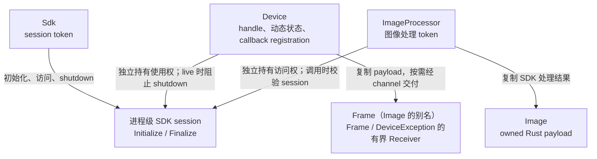
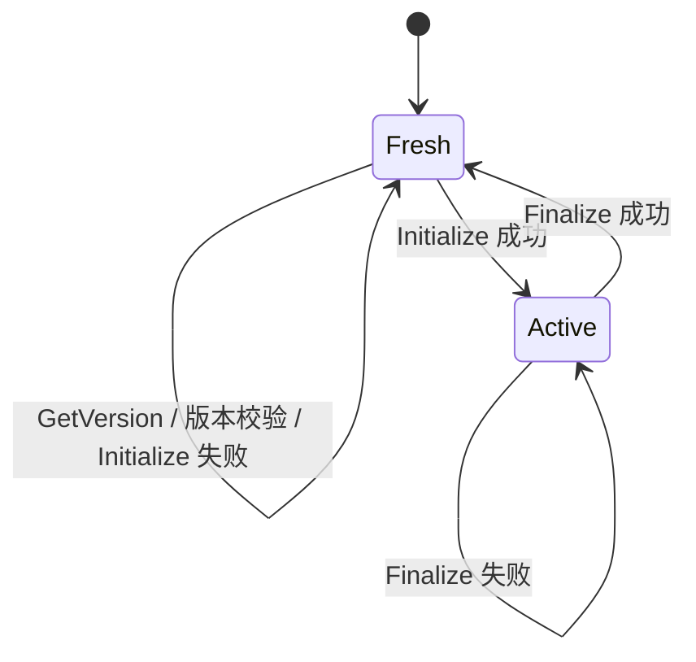
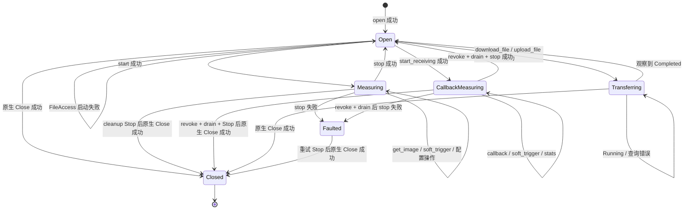

# 生命周期与时序图总览

## 所有权边界

`Sdk` 与 `ImageProcessor` 为 `Send + Sync`，`ImageProcessor` 与 `Device` 均不借用 `Sdk`。`Sdk` 的 `Drop` 只释放 token，session 仍为 `Active`。`Device` 为 `Send + !Sync`：它可以在普通 worker thread 中携带活动采集或文件传输的唯一所有权，同一时刻只允许一个线程调用该设备。`Frame` 是 `Image` 的类型别名；图像、事件和进度快照均拥有 Rust 数据。原生图像 descriptor 的校验集中在 internal FFI，payload 在返回前复制，且不设置任意的 512 MiB 上限。`shutdown()` 成功后，同一 session 的其他 token 停止接受 native 操作；缓存的 SDK 版本仍可读取。

## 进程级 SDK 状态

Initialize 失败后可直接重试。Finalize 只在 `live_handles == 0` 时调用；失败后 session 仍可用，也可再次调用 `shutdown()`。

## Device 完整状态

输入校验、pull/callback start 或 FileAccess 启动失败均不改变 `Open`。FileAccess 成功才进入 `Transferring`；进度为 Running 或查询失败时仍为 `Transferring`。库只提供单次进度快照，轮询、backoff 或 async 调度由调用方负责。descriptor 与字符串依据 `[IN]` 按调用期借用，若厂商另有异步借用要求则需复审。图中的 `Closed` 只表示原生 Close 成功；显式 Close 与 Drop 连续失败，或直接 Drop 的 Close 失败时，Rust owner 结束但 `live_handles` 不减。

| 状态 | 主要可用操作 |
| --- | --- |
| `Open` | 注册或禁用 exception delivery、启动采集、启动文件传输、close |
| `Measuring` | `get_image`、`soft_trigger`、`stop`、close |
| `CallbackMeasuring` | `soft_trigger`、callback stats、`stop`、close |
| `Transferring` | `file_transfer_progress`、close |
| `Faulted` | `disable_exception_delivery`、close 或 Drop |

`get_parameter`、`set_parameter`、`execute` 与 `clear_buffer` 当前对所有 live device state 直接转发；厂商允许矩阵待确认。

## 清理顺序

1. 撤销 image 与 exception cookie 准入，并等待已准入的 callback 返回。
2. 活动采集调用 Stop；成功后先把 phase 设为 `Open`，失败时为 `Faulted`。
3. 无论 Stop 结果如何都尝试 Close。原生 Close 成功后释放 handle 并减少 `live_handles`。
4. 显式 `close(self)` 首次 Close 失败时保留 handle；返回路径的 Drop 用同一 owner 再试一次。前一步 Stop 已成功时不重复 Stop，Stop 仍失败时随 Drop 再试。
5. Drop 的 Close 成功则减少 `live_handles`；显式 Close 与 Drop 连续失败，或直接 Drop 的 Close 失败时，计数不减并继续阻止 Finalize。Close 失败不限制新设备 open。

各路径细节：

- [标准生命周期与 pull 采集](时序图/标准生命周期与-pull-采集.md)
- [callback 采集与停止](时序图/callback-采集与停止.md)
- [文件上传与下载](时序图/文件上传与下载.md)
