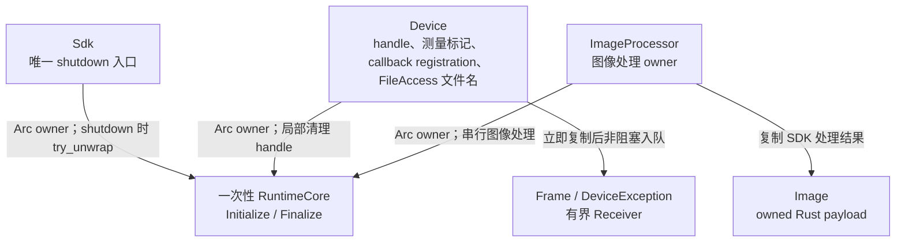
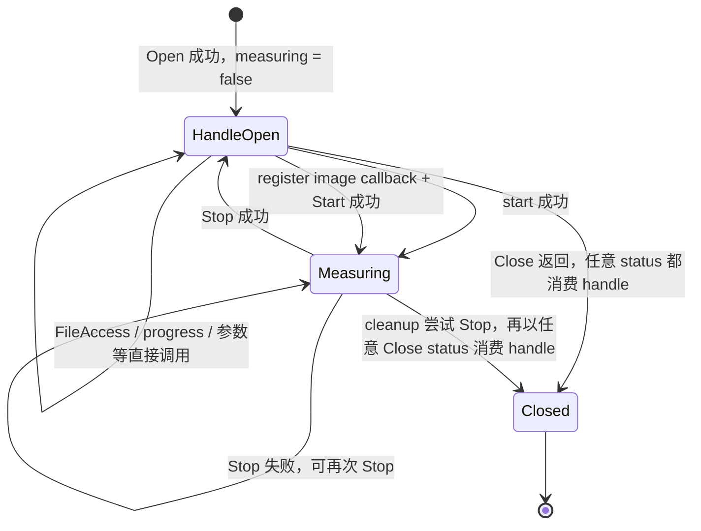

# 生命周期与时序图总览

## 所有权边界



`Sdk` 与 `ImageProcessor` 为 `Send + Sync`，`ImageProcessor` 与 `Device` 均不借用 `Sdk`。三个类型通过 `Arc` 共享同一个 `RuntimeCore`；`shutdown(self)` 仅需验证 `Sdk` 是最后一个 owner，不维护 session 状态或 handle 数量。同一 session 的图像处理调用会串行到 SDK 输出复制完成，防止下一次调用提前替换临时输出。`Device` 为 `Send + !Sync`，可将唯一 owner 移入普通 worker thread；官方多相机示例支持不同 handle 在各自线程取图。`Frame` 是 `Image` 的类型别名，图像、事件和文件进度快照均拥有 Rust 数据。原生图像 descriptor 的校验集中在 internal FFI，payload 在返回前复制，不设置任意容量上限。

## 进程级 SDK 生命周期

```mermaid
flowchart LR
    Process["新进程"] -->|首次且唯一一次 initialize| Claimed["初始化机会已消费"]
    Claimed -->|Initialize 成功| Session["RuntimeCore 由 Arc owners 共享"]
    Claimed -->|Initialize 失败| Exit["返回错误；仅能退出进程"]
    Session -->|shutdown(self) 且 owner 唯一| Finalize["调用一次 Finalize"]
    Session -->|Sdk 被 drop 或仍有其他 owner| Exit
    Finalize --> Exit
```

`Sdk::version()` 独立调用 `MV3D_LP_GetVersion`，可在 Initialize 前使用，返回 `SdkText` 原始字节，也不消费初始化机会。`Sdk::initialize()` 每个进程最多尝试一次；Initialize 失败、Finalize 返回或 `Sdk` 直接 drop 后均不提供重试或重启。`shutdown(self)` 消费 `Sdk`，只有 `Arc::try_unwrap` 成功才调用 Finalize；若 `Device` 或 `ImageProcessor` owner 仍存在，则返回状态错误，并把 Finalize 留给进程退出。

## Device 生命周期

`Device` 不公开状态枚举，只保存一个 `measuring` 标记。该标记用于拒绝重复 Start 和停止状态下的 Stop；其余设备接口直接交给 SDK 判断调用顺序。



callback Start 失败时撤销本次 cookie；Stop 成功后撤销 image cookie。cookie 从不复用，迟到 callback 找不到旧 registration，不会投递到后续 registration。Stop 或 disable 前已经取得 sink 的 callback 可以完成本次投递，撤销操作不等待它；Close 则依赖厂商在返回前使该 handle 的 native callback 静默。

FileAccess 不引入传输状态。Read/Write 成功后，`Device` 保留 descriptor 中的两段 CString；下一次成功 FileAccess 替换旧值，失败不改变已保存值。Close 返回时依赖厂商已停止引用文件名，随后才释放 CString。`file_transfer_progress()` 直接返回 `FileProgress { completed: i64, total: i64 }`，不判断 Running、Completed 或数值范围。

## 清理顺序

1. `Device` 先取走自己的 handle，使显式 `close(self)` 返回后的 `Drop` 不会再次关闭。
2. 若 `measuring` 为 true，调用一次 `MV3D_LP_StopMeasure`。
3. 无论 Stop 结果如何，调用一次 `MV3D_LP_CloseDevice`；任意 status 都使 handle 永久失效并消费 owner。
4. 依赖 Close 返回时 native callback 已静默、FileAccess 已停止引用文件名，再撤销 image/exception cookie 并释放 CString。
5. 显式 `close()` 返回 Stop 与 Close 的错误；`Drop` 忽略同一路径的错误。Close 的错误 status 不恢复 owner，也不重试。

## Fail-fast 边界

SDK status、调用方输入和公开状态错误通过 `Result` 返回。应用若选择强制终止，应让错误先离开持有 `Device` 的 `run()` 作用域，使 `Drop` 执行 Stop→Close，再由 `main()` 记录错误并终止进程：

```rust
fn main() {
    if let Err(error) = run() {
        eprintln!("fatal: {error}");
        std::process::abort();
    }
}
```

任意 worker thread 的 panic 也需终止进程时，由最终 binary 所属 workspace 统一设置：

```toml
[profile.release]
panic = "abort"
```

依赖库无法代替最终 binary 选择 panic 策略。

callback ABI 边界无法安全恢复 panic。callback 自身 panic、registry 或图像处理锁中毒，以及 SDK 传入空 callback 参数或非法 descriptor，均直接失败并终止进程。未知或已撤销的 cookie 代表迟到 callback，继续忽略。进程终止路径依赖操作系统回收进程资源；Stop→Close 的 Rust 清理保证只适用于普通错误返回和正常 drop。

## 待确认厂商契约

- Get/Set/Execute/ClearDataBuffer 在各设备状态下的允许矩阵，以及 Node Name 的编码、字符集和最大长度。
- callback 注销、重复注册和跨 Stop 替换规则见 [callback 采集与停止](时序图/callback-采集与停止.md#待确认厂商契约)。
- 文件名持有和进度语义见 [文件上传与下载](时序图/文件上传与下载.md#待确认厂商契约)。

各路径细节：

- [标准生命周期与 pull 采集](时序图/标准生命周期与-pull-采集.md)
- [callback 采集与停止](时序图/callback-采集与停止.md)
- [文件上传与下载](时序图/文件上传与下载.md)
