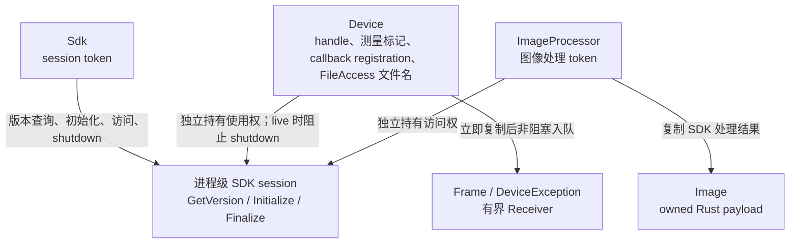
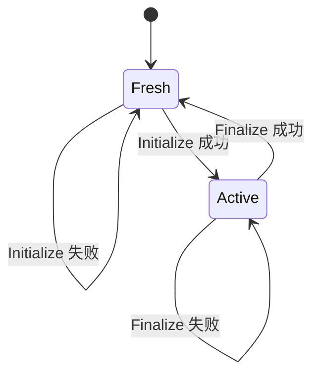
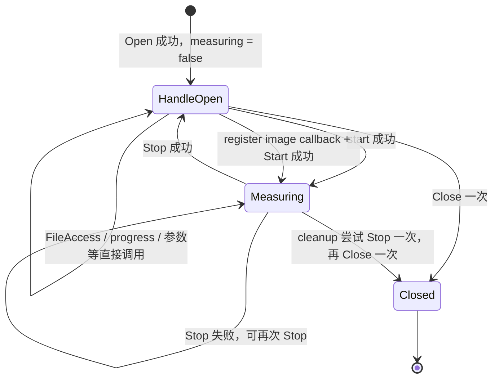

# 生命周期与时序图总览

## 所有权边界

`Sdk` 与 `ImageProcessor` 为 `Send + Sync`，`ImageProcessor` 与 `Device` 均不借用 `Sdk`。`Device` 为 `Send + !Sync`，可将唯一 owner 移入普通 worker thread；官方多相机示例支持不同 handle 在各自线程取图。`Frame` 是 `Image` 的类型别名，图像、事件和文件进度快照均拥有 Rust 数据。原生图像 descriptor 的校验集中在 internal FFI，payload 在返回前复制，不设置任意容量上限。

## 进程级 SDK 生命周期

`Sdk::version()` 独立调用 `MV3D_LP_GetVersion`，可在 Initialize 前使用，返回 `SdkText` 原始字节。`Sdk` 的 `Drop` 只释放 token；`shutdown()` 在 live `Device` owner 为零时调用 Finalize。

## Device 生命周期

`Device` 不公开状态枚举，只保存一个 `measuring` 标记。该标记用于拒绝重复 Start 和停止状态下的 Stop；其余设备接口直接交给 SDK 判断调用顺序。

callback Start 失败时撤销本次 cookie；Stop 成功后撤销 image cookie。cookie 从不复用，迟到 callback 找不到旧 registration，不会投递到后续 registration。已经取得 sink 的 callback 可以自行返回，撤销操作不等待它。

FileAccess 不引入传输状态。Read/Write 成功后，`Device` 保留 descriptor 中的两段 CString；下一次成功 FileAccess 替换旧值，失败不改变已保存值，关闭或 Drop 时释放。`file_transfer_progress()` 直接返回 `FileProgress { completed: i64, total: i64 }`，不判断 Running、Completed 或数值范围。

## 清理顺序

1. `Device` 先取走自己的 handle，使显式 `close(self)` 返回后的 `Drop` 不会再次关闭。
2. 若 `measuring` 为 true，调用一次 `MV3D_LP_StopMeasure`。
3. 无论 Stop 结果如何，调用一次 `MV3D_LP_CloseDevice`。
4. 撤销 image 与 exception cookie，并随 owner 释放保存的 FileAccess 文件名。
5. 显式 `close()` 返回 Stop 与 Close 的错误；`Drop` 忽略同一路径的错误。每个 owner 最多提交一次 Close，不重试。

各路径细节：

- [标准生命周期与 pull 采集](时序图/标准生命周期与-pull-采集.md)
- [callback 采集与停止](时序图/callback-采集与停止.md)
- [文件上传与下载](时序图/文件上传与下载.md)
