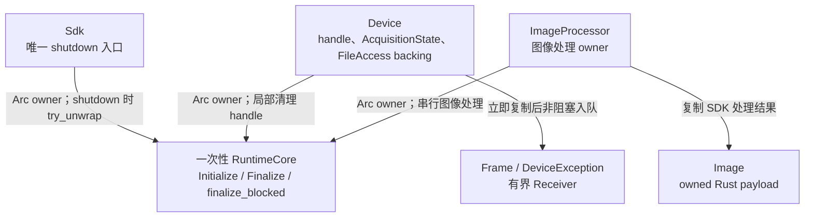
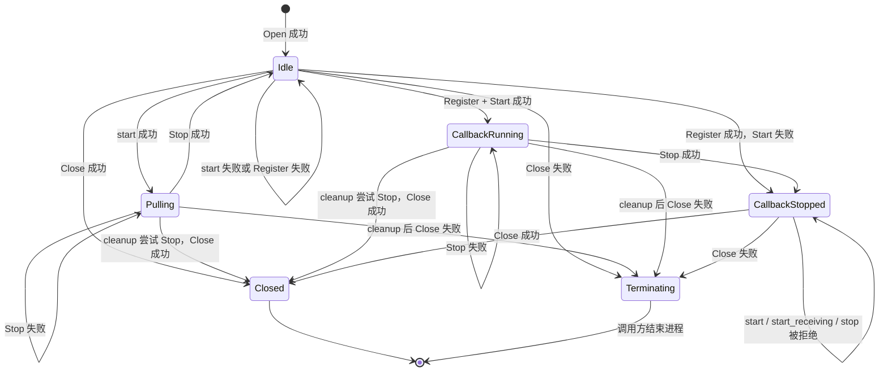

# 生命周期与时序图总览

## 所有权边界



`Sdk` 与 `ImageProcessor` 为 `Send + Sync`，`ImageProcessor` 与 `Device` 均不借用 `Sdk`。三个类型通过 `Arc` 共享同一个 `RuntimeCore`；`shutdown(self)` 验证 `Sdk` 是最后一个 owner，并检查单向的 `finalize_blocked` 标记。同一 session 的图像处理调用会串行到 SDK 输出复制完成，防止下一次调用提前替换临时输出。`Device` 为 `Send + !Sync`，可将唯一 owner 移入普通 worker thread；官方多相机示例支持不同 handle 在各自线程取图。`Frame` 是 `Image` 的类型别名，图像、事件和文件进度快照均拥有 Rust 数据。原生图像 descriptor 的校验集中在 internal FFI，payload 在返回前复制，不设置任意容量上限。

## 进程级 SDK 生命周期

```mermaid
flowchart LR
    Process["新进程"] -->|首次且唯一一次 initialize| Claimed["初始化机会已消费"]
    Claimed -->|Initialize 成功| Session["RuntimeCore 由 Arc owners 共享"]
    Claimed -->|Initialize 失败| Error["Err 返回调用方"]
    Session -->|shutdown(self)、owner 唯一且未阻止| Finalize["调用一次 Finalize"]
    Session -->|owner 存在或 finalize_blocked| Error
    Session -->|Sdk drop| Skip["跳过 Finalize"]
    Finalize --> Exit
    Error -->|最终 binary 决定| Exit["结束进程"]
    Skip --> Exit
```

`Sdk::version()` 独立调用 `MV3D_LP_GetVersion`，可在 Initialize 前使用，返回 `SdkText` 原始字节，也不消费初始化机会。`Sdk::initialize()` 每个进程最多尝试一次；Initialize 失败、Finalize 返回或 `Sdk` 直接 drop 后均不提供重试或重启。`Sdk` 的 Drop 不调用 Finalize。`shutdown(self)` 消费 `Sdk`：先通过 `Arc::try_unwrap` 验证其他 session owner 已释放，再检查 `finalize_blocked`。任一 Device 的 Close 失败都会永久置位该标记；此后 `shutdown` 返回 `InvalidState`，不进入 native Finalize。错误是否终止进程由最终 binary 决定。

## Device 生命周期

`Device` 用一个内部 `AcquisitionState` 表达 `Idle`、`Pulling`、`CallbackRunning` 和 `CallbackStopped`。`start()` 与 `start_receiving()` 仅接受 `Idle`；`stop()` 仅接受两个运行态。Register 成功后先保存 `CallbackStopped`，再调用 Start，因此 Start 失败仍由同一 owner 保存 registration。callback Stop 成功进入 `CallbackStopped`，该状态只能走向 Close，避免依赖厂商未说明的注销、重复注册和模式切换行为。



image registration 从 Register 成功保存至 Close 调用返回，覆盖 Start 失败和 Stop 成功路径。cookie 从不复用且不作为指针解引用；Close 返回后撤销 cookie，迟到 callback 查询失败。Close 前已经取得 sink 的 callback 可以完成本次投递，撤销操作不等待它。仅 Close 成功被视为该 handle 的 native callback 静默边界；Close 失败时由 `finalize_blocked` 阻止 Finalize，再由调用方结束进程。

FileAccess 不引入传输状态。每次 Read/Write 成功后，`Device` 都追加保存 descriptor 中的两段 CString，避免依赖“下一次成功传输替代旧引用”的未确认契约；失败调用不保存本次文件名。Close 成功后统一释放全部 CString；Close 失败时将其封存至进程退出。`file_transfer_progress()` 直接返回 `FileProgress { completed: i64, total: i64 }`，不判断 Running、Completed 或数值范围。

## 清理顺序

1. `Device` 先取走自己的 handle，使显式 `close(self)` 返回后的 `Drop` 不会再次关闭。
2. `Pulling` 或 `CallbackRunning` 调用一次 `MV3D_LP_StopMeasure`。
3. Stop 的结果不阻断一次 `MV3D_LP_CloseDevice`。
4. Close 成功返回后撤销 image/exception cookie，释放全部 FileAccess backing 和 session owner。
5. Close 失败返回后撤销 callback cookie，封存全部 FileAccess backing，永久置位 `finalize_blocked`；Rust owner 已消费，native handle 状态交给进程退出处理。
6. Stop 或 Close 只有一个错误时原样返回；两者同时失败时返回 `Error::DeviceCleanup { stop, close }`。`Drop` 执行同一路径但无法向调用方返回错误。

## 错误传播与终止边界

| 场景 | 公开结果 | 资源与后续 |
| --- | --- | --- |
| 普通 SDK status、调用方输入、公开状态或同步输出契约错误 | `Result::Err` | wrapper 不自动重试；调用方决定策略 |
| Stop 或 Close 单独失败 | 原始错误 | Close 仍只调用一次；Close 失败进入终止分支 |
| Stop 与 Close 同时失败 | `Error::DeviceCleanup { stop, close }` | 两个错误均交给调用方 |
| `Device` 的 Drop | 无返回值 | 执行同一清理；Close 失败仍封存 backing 并阻止 Finalize |
| `Sdk::shutdown(self)` 遇到 session owner 或 `finalize_blocked` | `Error::InvalidState` | 不调用 native Finalize；`Sdk` 已消费 |
| image callback 队列满 | 丢弃最新 frame，继续 delivery | 不产生 `Error` |
| exception callback 队列满 | 丢弃当前事件并停止 Rust delivery | Receiver 最终断开，原因不编码 |
| callback ABI panic、空参数或非法 descriptor | 立即终止进程 | ABI 无法返回 `Result`，Rust Drop 不执行 |

项目采用终止式调用示例：普通错误先离开持有 `Device` 的 `run()` 作用域，使可执行的 Drop 完成，再由 `main()` 记录错误并终止进程：

```rust
fn main() {
    if let Err(error) = run() {
        eprintln!("fatal: {error}");
        std::process::abort();
    }
}
```

release binary 要求任意 worker thread 的 panic 终止进程时，由最终 binary 所属 workspace 设置：

```toml
[profile.release]
panic = "abort"
```

依赖库无法代替最终 binary 选择 panic 策略；dev 或 test profile 需要同类策略时应分别配置。

callback ABI 边界无法返回 Rust 错误。callback 自身 panic，以及 SDK 传入空 callback 参数或非法 descriptor，均直接终止进程。未知或已撤销的非空 cookie 代表迟到 callback，继续忽略。registry 与图像处理 mutex 只承担串行访问，遇到 poison 时恢复 guard，不把普通 Rust panic 改写为库级 abort。进程终止依赖操作系统回收资源；Stop→Close 的 Rust 清理只适用于普通错误返回和正常 Drop。

## 待确认厂商契约

- Get/Set/Execute/ClearDataBuffer 在各设备状态下的允许矩阵，以及 Node Name 的编码、字符集和最大长度。
- callback 原生注销规则见 [callback 采集与停止](时序图/callback-采集与停止.md#待确认厂商契约)。
- 文件名持有和进度语义见 [文件上传与下载](时序图/文件上传与下载.md#待确认厂商契约)。

各路径细节：

- [标准生命周期与 pull 采集](时序图/标准生命周期与-pull-采集.md)
- [callback 采集与停止](时序图/callback-采集与停止.md)
- [文件上传与下载](时序图/文件上传与下载.md)
