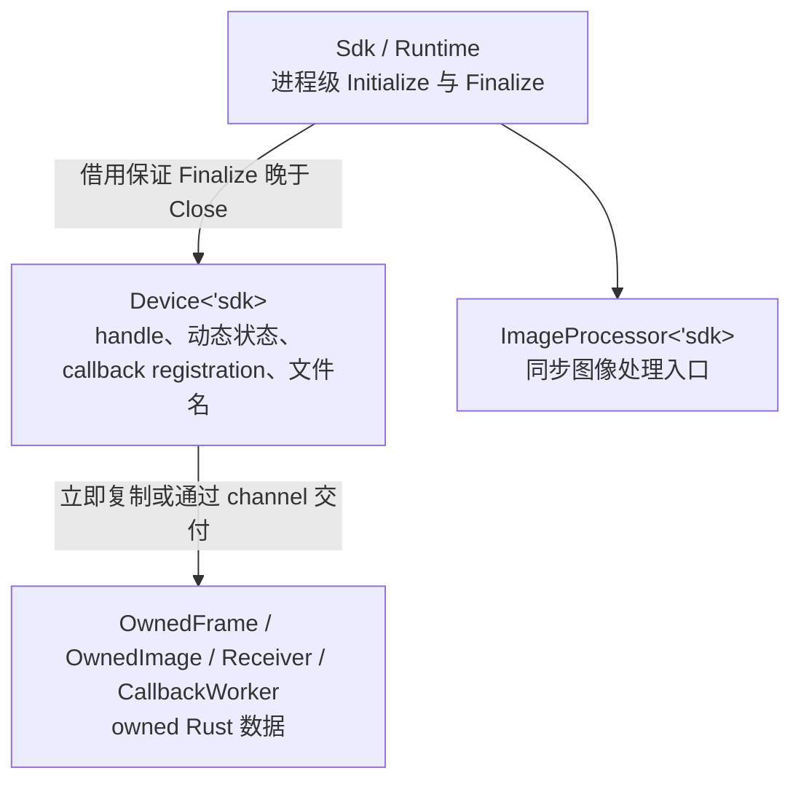
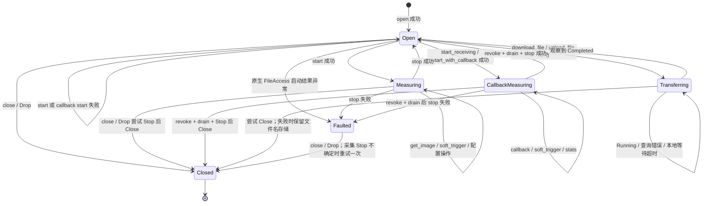

# 生命周期与时序图总览

## 所有权边界

`Sdk` 与 `ImageProcessor` 为 `!Send + !Sync`。`Device` 为 `Send + !Sync`：它可以携带活动采集或文件传输的唯一所有权跨线程移动，同一时刻只允许一个线程调用 SDK。帧、事件和进度快照均为 owned Rust 数据，不借用原生 payload。

## Device 完整状态

状态转换只在原生调用成功或结果不确定时发生。输入校验失败保持原状态；pull/callback start 失败保持 `Open`。FileAccess 原生启动失败进入 `Faulted`，因为 SDK 可能已开始异步读取文件名。进度查询失败和本地等待超时保持 `Transferring`，便于重试。

| 状态 | 主要可用操作 |
| --- | --- |
| `Open` | 配置、清 buffer、注册或禁用 exception delivery、启动采集、启动文件传输、close |
| `Measuring` | `get_image`、`soft_trigger`、配置、清 buffer、`stop`、close |
| `CallbackMeasuring` | `soft_trigger`、callback stats、`stop`、close |
| `Transferring` | `file_transfer_progress`、`wait_file_transfer`、close |
| `Faulted` | `disable_exception_delivery`、close 或 Drop |

## 清理顺序

1. 撤销 image 与 exception cookie 准入，并等待已准入的 callback 返回。
2. 活动采集调用 Stop；由 Stop 失败进入的 `Faulted` 在 close/Drop 时再尝试一次。
3. 无论 Stop 结果如何都继续尝试 Close，并汇总显式 `close()` 可观察的错误。
4. Close 成功后释放异步文件名并更新 Runtime 的 live handle 计数；Close 失败时故意保留文件名存储，并使 Runtime 进入 `Degraded`。
5. 最后一个 `Device<'sdk>` 结束后，`Sdk::shutdown()` 才能 Finalize。

各路径细节：

- [标准生命周期与 pull 采集](时序图/标准生命周期与-pull-采集.md)
- [callback 采集与停止](时序图/callback-采集与停止.md)
- [文件上传与下载](时序图/文件上传与下载.md)
